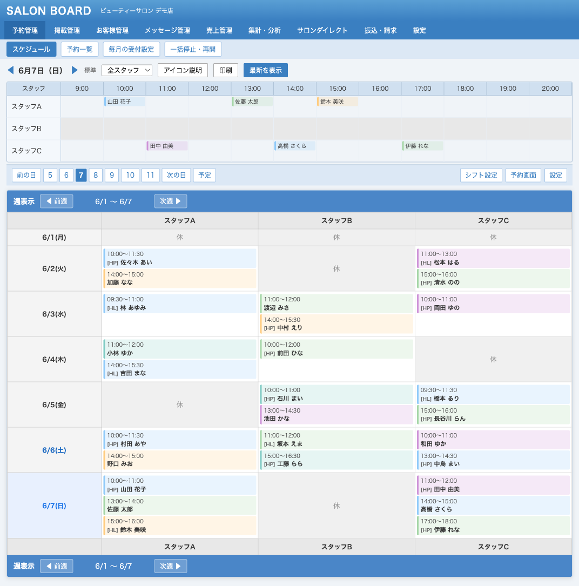
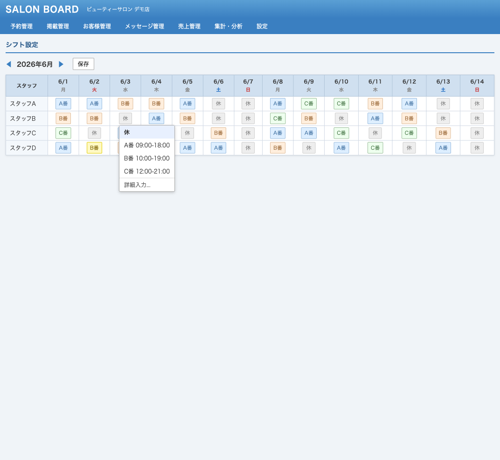
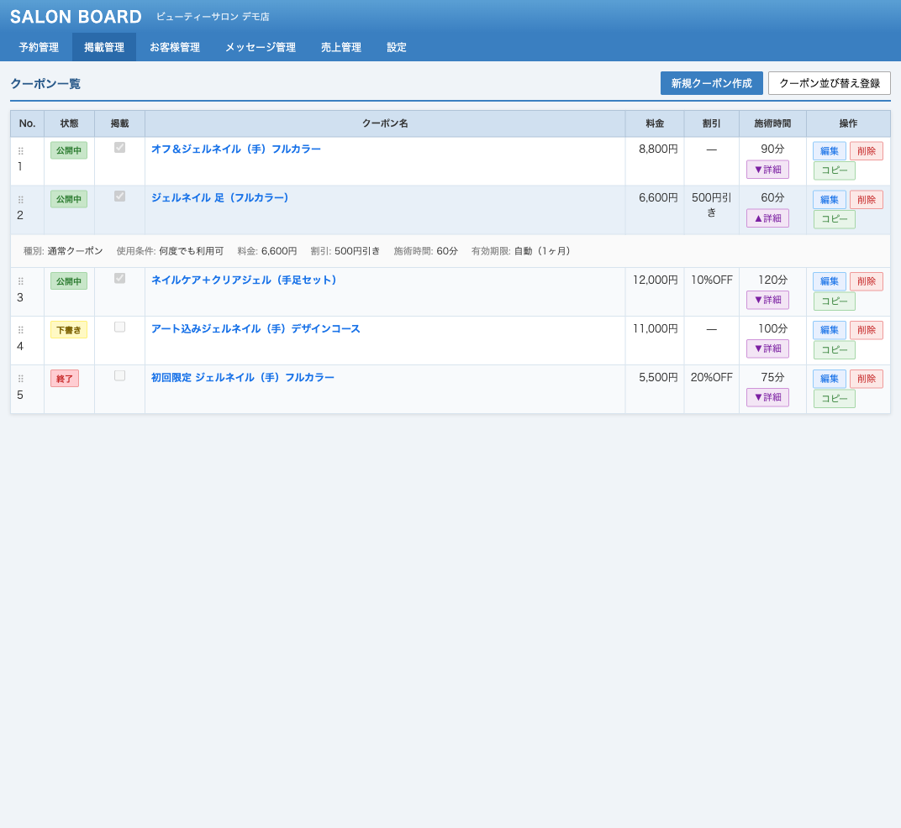
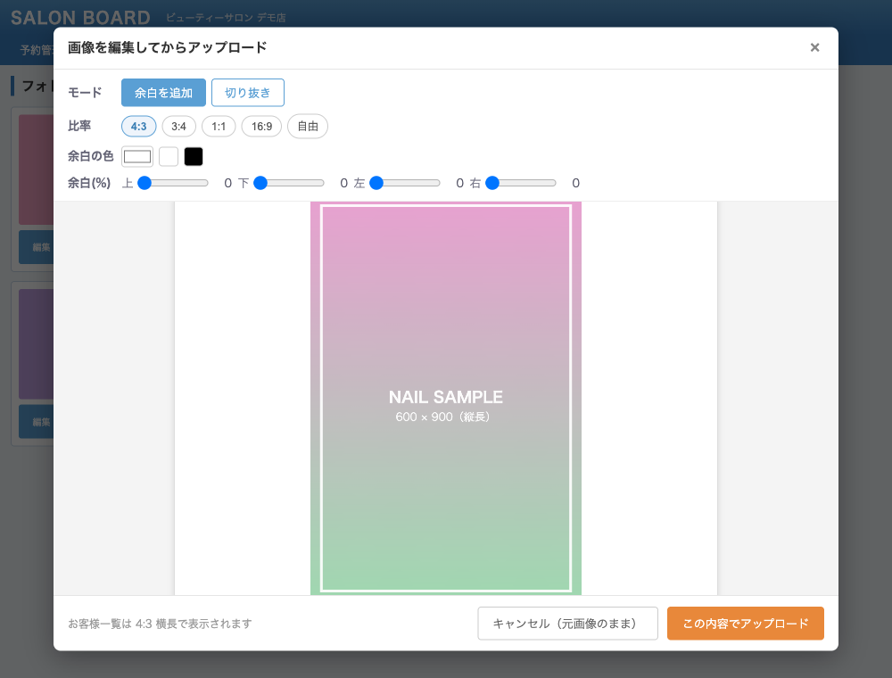

# tm-salon-board

サロンボード（サロン向けSaaS）のUI改善 TamperMonkey スクリプト集。

## 使い方

1. TamperMonkey をインストール

    ブラウザに [TamperMonkey](https://www.tampermonkey.net/) 拡張機能を追加する。

2. スクリプトをインストール

    下記スクリプト一覧のインストールリンクをクリック → TamperMonkey の確認画面で「インストール」をクリック。

3. サロンボードにアクセス

    対象ページを開くと自動でスクリプトが適用される。

---

## スクリプト一覧

| カテゴリ | スクリプト | 説明 | インストール |
|---------|-----------|------|------------|
| スケジュール | [スケジュール 週表示](#スケジュール-週表示) | スケジュール画面に7日分の週表示パネルを追加 |  |
| シフト | [シフトセル インライン編集](#シフトセル-インライン編集) | シフト設定画面の各セルをプルダウンで直接変更 |  |
| クーポン | [クーポンリスト強化](#クーポンリスト強化) | クーポン一覧にコピー・インライン詳細表示・並べ替えを追加 |  |
| フォト | [フォトギャラリー画像編集](#フォトギャラリー画像編集) | フォト投稿時にトリミング・余白追加（アスペクト比調整）ができる編集画面を追加 |  |

---

### スケジュール

#### スケジュール 週表示

スケジュール画面の日付ナビ下に7日分（月〜日）の週表示パネルを自動表示する。

| 操作 | 動作 |
|------|------|
| ページを開く | 週表示パネルが自動で表示される |
| 日付をクリック | その日の詳細スケジュールページへ移動 |
| 「前週」「次週」ボタン（上部・下部） | 表示週を前後に切り替え |

---

### シフト

#### シフトセル インライン編集

シフト設定画面の各セルをクリックするとプルダウンが表示され、モーダルを開かずにシフトを直接変更できる。

| 操作 | 動作 |
|------|------|
| セルをクリック | プルダウンが表示される |
| シフト名を選択 | 即座に保存・セルが黄色（設定箇所）になる |
| 元の値に戻す | 保存しつつ黄色が消えて元の色に戻る |
| 「詳細入力...」を選択 | 元のモーダルが開き予定の入力もできる |

---

### クーポン

#### クーポンリスト強化

クーポン一覧ページに以下の機能を追加する。

| 操作 | 動作 |
|------|------|
| ドラッグ&ドロップ | クーポンの並び順を入れ替え |
| 詳細トグル | 行をクリックしてインラインでクーポン詳細を表示 |
| コピーボタン | クーポン情報をコピーして新規作成画面に貼り付け |

---

### フォト

#### フォトギャラリー画像編集

フォトギャラリーに写真をアップロードする際、画面上でトリミング・余白追加（アスペクト比の調整）ができる編集画面を自動表示する。お客様用一覧は 4:3 横長で表示されるため、縦長画像でも余白を付けてきれいに収められる。すでに登録済みの写真も「編集」ボタンから同じ編集画面で直して上書き再アップロードできる。

| 操作 | 動作 |
|------|------|
| 画像を選択（ファイル選択・ドラッグ&ドロップ） | 編集画面が自動で開く |
| 登録済み写真の「編集」ボタン | 現在の画像を読み込んで編集 → そのスロットに上書き再アップロード |
| 「余白を追加」モード | 画像全体を対象比率に収め、上下左右に余白（色指定可）を付ける |
| 「切り抜き」モード | 範囲をドラッグして対象比率にトリミング |
| 比率プリセット（4:3 / 3:4 / 1:1 / 16:9 / 自由） | トリミング枠・余白の比率を切り替え |
| 「この内容でアップロード」 | 編集後の画像をそのままアップロード（1ステップで完了） |
| 「キャンセル（元画像のまま）」 | 編集せず元画像をそのまま使う |
